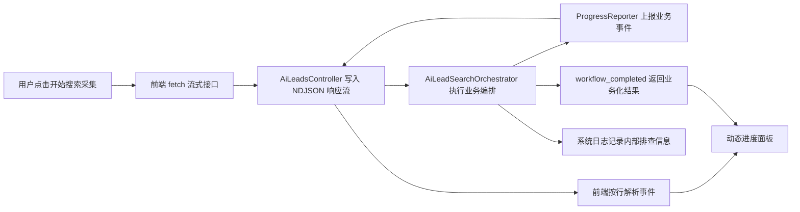

# AI 获客搜索采集进度流设计

## 背景

当前 `AI获客` 页面点击 `开始搜索采集` 后，会直接调用 `POST /ai-leads/search-orchestrate`。后端完成关键词优化、公开线索采集、质量判断、候选汇总后一次性返回结果。这个过程可能持续几十秒到数分钟，前端只能显示按钮 loading，用户不知道任务是否卡住、当前做到了哪里、已经采集出多少候选线索。

同时，当前结果面板会直接展示完整 JSON，其中包含底层搜索服务请求、决策明细等技术信息。普通用户不应该看到具体搜索技术、endpoint、原始请求体或技术决策 JSON。用户只需要看到业务动作，例如 `采集公开线索`、`判断线索质量`、`整理候选客户`。

后续搜索采集流程还会穿插更多步骤，例如官网访问、联系方式提取、去重、CRM 入库、开发信素材整理等。因此进度设计不能写死成固定的 1、2、3、4 步，而应该由后端动态上报业务事件，前端按事件流渲染。

## 目标

- 用户点击 `开始搜索采集` 后，能实时看到当前采集进度。
- 用户侧只显示业务化文案，不暴露底层搜索服务、endpoint、请求体、技术决策结构。
- 后端支持动态穿插步骤，新增步骤时不需要重写前端进度组件。
- 保留现有 `search-orchestrate` 能力，新增流式入口复用同一套编排逻辑。
- 最终结果也应业务化展示，避免普通用户继续看到原始技术 JSON。
- 编排内部仍记录系统日志，方便超级管理员或开发者定位问题。

## 非目标

- 不在本阶段引入完整任务队列、后台持久任务或断点续跑。
- 不实现暂停、恢复、多端协同等双向控制能力。
- 不把底层搜索服务名称开放给普通用户。
- 不为了进度展示提前抽象成全站通用任务中心。
- 不运行 `npm run build` 作为验证步骤。

## 方案选择

采用 `fetch` 读取后端流式响应，后端按行输出 JSON 事件，也就是 `NDJSON` 流。

不优先使用原生 `EventSource`，因为当前接口需要 `POST` 请求体和 `Authorization` header，而原生 `EventSource` 更适合无 body 的 `GET` 场景。也不优先使用 WebSocket，因为当前需求只是后端单向推送进度，WebSocket 的连接管理和双向协议成本偏高。

推荐新增接口：

```txt
POST /ai-leads/search-orchestrate/stream
Content-Type: application/json
Accept: application/x-ndjson
Authorization: Bearer <token>
```

响应每一行都是一个完整 JSON 事件。前端用 `ReadableStream` 逐块读取，按换行解析事件。

## 后端设计

### Progress Reporter

在 AI 获客搜索编排器中新增一个可选的进度上报接口，而不是让 Controller 直接侵入编排细节。

```ts
export interface LeadSearchProgressReporter {
  emit(event: LeadSearchProgressEvent): void | Promise<void>;
}
```

`AiLeadSearchOrchestrator.search` 继续负责业务编排，新增可选 reporter 参数：

```ts
search(dto: SearchOrchestrateDto, context: AiLeadSearchContext, reporter?: LeadSearchProgressReporter)
```

普通非流式接口不传 reporter，行为保持现状。流式接口传入 reporter，把编排过程中的业务事件写入 HTTP 响应流。

`AI获客` 页面切到流式接口后，不再把旧接口返回的完整技术 JSON 作为普通用户结果展示。旧接口仅作为兼容入口保留，后续如果继续面向页面使用，也需要同步改成业务化结果结构。

### 事件协议

事件协议固定，步骤内容动态。前端只依赖 `type`、`stepKey`、`title`、`metrics` 等通用字段，不依赖固定步骤列表。

```ts
type LeadSearchProgressEventType =
  | 'workflow_started'
  | 'step_started'
  | 'step_progress'
  | 'step_completed'
  | 'workflow_completed'
  | 'workflow_failed';

interface LeadSearchProgressEvent {
  type: LeadSearchProgressEventType;
  runId: string;
  sequence: number;
  emittedAt: string;
  stepKey?: string;
  parentKey?: string;
  title?: string;
  description?: string;
  progressPercent?: number;
  metrics?: LeadSearchProgressMetric[];
  result?: LeadSearchPublicResult;
  errorMessage?: string;
}

interface LeadSearchProgressMetric {
  key: string;
  label: string;
  value: number | string;
  total?: number;
}
```

`stepKey` 是业务步骤标识，例如：

- `understand_requirement`
- `plan_collection_directions`
- `collect_public_leads`
- `analyze_candidate_quality`
- `organize_candidates`
- `extract_contact_clues`
- `dedupe_candidates`
- `save_to_crm`

这些 key 不是前端写死的流程顺序。后端按实际执行顺序发事件，前端按 `sequence` 和事件到达顺序渲染。

### 用户安全文案

流式事件中只允许出现业务语言：

- `采集动作`
- `采集方向`
- `公开线索`
- `候选线索`
- `质量判断`
- `整理结果`

不在事件中输出以下信息：

- 搜索服务商名称
- endpoint 名称
- 原始搜索请求体
- API key、token、Cookie
- 技术决策 JSON
- 供应商返回的完整原始响应

底层信息如果需要排查，继续写入后端系统日志。日志按现有日志规则脱敏，禁止写入完整密钥、token、Cookie 等敏感信息。

### 编排阶段映射

当前后端编排可以先映射为以下业务事件，但这只是初始实现，不是固定流程：

1. `workflow_started`：开始搜索采集。
2. `step_started: understand_requirement`：理解获客需求。
3. `step_completed: understand_requirement`：关键词规划完成。
4. `step_started/progress: collect_public_leads`：按采集方向抓取公开线索。
5. `step_started/progress/completed: analyze_candidate_quality`：判断当前结果是否需要翻页、换方向或停止。
6. `step_completed: organize_candidates`：整理候选线索。
7. `workflow_completed`：返回业务化最终结果。

后续新增官网访问、联系方式提取、CRM 入库时，只需要在对应业务方法里继续调用 reporter，上报新的 `stepKey`。

### 结果结构

流式接口的最终 `workflow_completed` 事件返回用户安全的 `LeadSearchPublicResult`，不返回技术 trace。

```ts
interface LeadSearchPublicResult {
  summary: {
    actionCount: number;
    qualityCheckCount: number;
    candidateCount: number;
    stopReason: string;
  };
  candidates: LeadSearchCandidateView[];
  warnings?: string[];
}

interface LeadSearchCandidateView {
  title?: string;
  website?: string;
  snippet?: string;
  address?: string;
  phoneNumber?: string;
  sourceLabel: string;
}
```

现有内部结果中的 `serperRequests`、`decisions` 等技术 trace 不进入普通用户流式响应。若后续确实需要管理员调试，可以单独设计受权限保护的调试接口或系统日志详情，不混在用户采集结果里。

## 前端设计

### API 封装

在 `src/service/api/ai-leads.ts` 增加流式方法，例如：

```ts
export function streamLeadCustomerSearch(
  data: Api.AiLeads.SearchOrchestratePayload,
  handlers: LeadSearchStreamHandlers
) {}
```

该方法使用原生 `fetch`，从现有 `getAuthorization()` 读取认证头，并按行解析 `application/x-ndjson`。由于这是浏览器流式读取，不复用当前 axios request 封装。

### 页面状态

`src/views/ai-leads/index.vue` 保持页面编排职责。进度状态可以放在页面私有模块中，例如：

- `src/views/ai-leads/modules/SearchProgressPanel.vue`
- `src/views/ai-leads/modules/useLeadSearchProgress.ts`
- `src/views/ai-leads/modules/progress.ts`

`useLeadSearchProgress` 负责把事件流归并成 UI 状态：

- `steps`
- `activeStep`
- `metrics`
- `progressPercent`
- `result`
- `errorMessage`

前端只根据事件字段渲染，不维护固定步骤枚举。未知 `stepKey` 也能显示，因为事件自带 `title` 和 `description`。

### UI 展示

搜索中展示一个紧凑进度面板：

- 标题：`正在采集潜在客户`
- 总进度：有 `progressPercent` 时显示确定进度；没有时显示进行中状态。
- 动态步骤：按事件流展示已完成、进行中、等待出现过的步骤。
- 当前动作：显示 `description`。
- 指标：显示后端给出的 `metrics`，例如 `采集动作 6/20`、`候选线索 18`、`质量判断 5`。

搜索完成后展示业务化结果摘要，不再给普通用户展示完整 JSON。

## 数据流



## 错误处理

- 后端编排异常时，流中写入 `workflow_failed`，包含用户可读的 `errorMessage`。
- HTTP 连接异常时，前端显示 `搜索采集中断，请稍后重试`。
- 用户手动离开页面或再次发起搜索时，前端使用 `AbortController` 中止当前流。
- 后端不要静默吞掉错误。记录系统日志后，仍按事件或异常响应给前端。
- 不做多层假兜底，不用前端假进度掩盖真实后端状态。

## 验证建议

不运行 `npm run build`。

实现后建议做最小验证：

- 后端单元测试：reporter 能收到 `workflow_started`、至少一个 `step_progress`、`workflow_completed`。
- 后端单元测试：异常时能写入 `workflow_failed` 或抛出可识别错误。
- 前端单元测试：NDJSON 分块解析能处理半行、连续多行和最后一行。
- 手动验证：点击 `开始搜索采集` 后，进度面板能逐步更新，页面不显示底层搜索服务名称。
- 手动验证：完成后结果面板只显示业务化摘要和候选线索。
